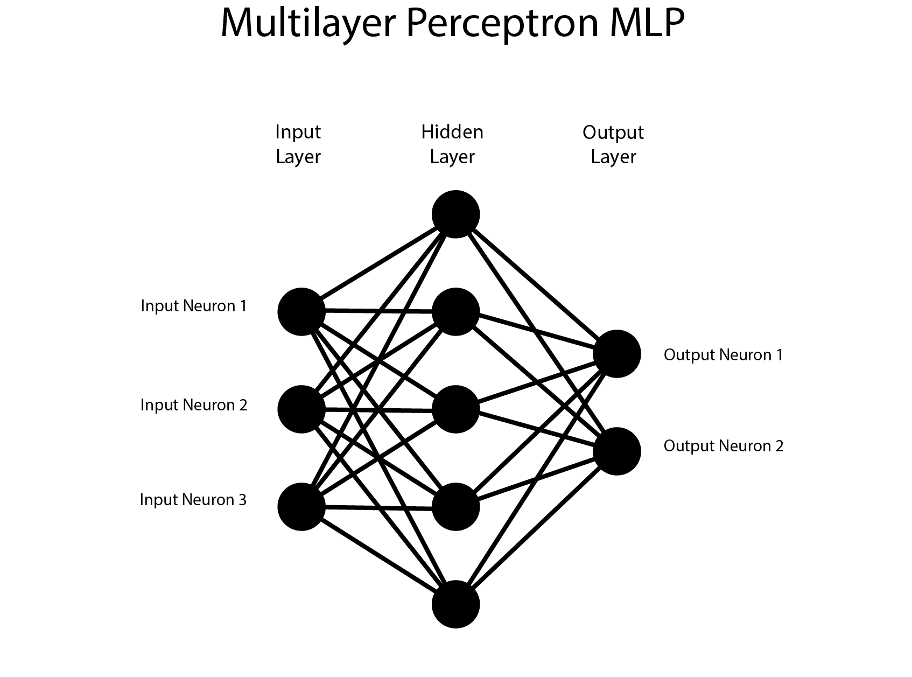
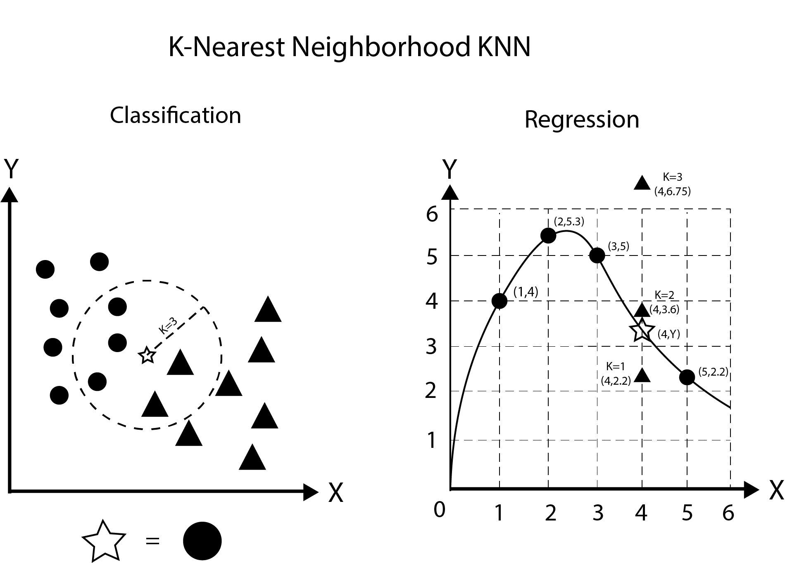

# AI智能錢包
### [英文版 English version](./README.md)
## 概述
一款智慧錢包，利用定位服務（GPS/WiFi）為使用者推薦最佳選擇。

透過收集定位資料，可自動顯示進出場所所需的 QR Code，免去攜帶實體票券的麻煩，降低遺失或損壞風險。

## 快速導覽
1. [關鍵知識](#關鍵知識)
2. [範例情境](#範例情境)
3. [元件清單](#元件清單)
4. [軟體清單](#軟體清單)
5. [圖示](#圖示)
6. [引用](#引用)
7. [公式](#公式)
8. [相關連結](#相關連結)
9. [參考文章](#參考文章)

## 關鍵知識
- 多層感知器（MLP）
- K近鄰演算法（KNN）
- 歐氏距離
- WiFi指紋定位技術
- 數學
   - 歐拉數
   - 平方根
   - 偏微分
   - 累加
   - 陣列、向量
   - 稀疏交叉熵

## 範例情境
分析定位資料，當使用者抵達車站、學校或常去的地點時，錢包會檢查是否已儲存票券。
若有，則自動顯示進出用 QR Code。
若無，則透過 MOSFET 控制線圈，啟用悠遊卡功能。

## 元件清單
| 類型 | 元件 | 通訊方式 | 應用說明 | 價格(NTD) | 數量 | 單位 |
| --- | --- | --- | --- | --- | --- | --- |
| 主板 | [ST STM32H7VIT6](https://shopee.tw/STM32H7%E6%A0%B8%E5%BF%83%E6%9D%BF-%E5%8E%9F%E8%A3%9DSTM32H750VBT6-STM32H743VIT6-%E9%96%8B%E7%99%BC%E6%9D%BF%E6%A0%B8%E5%BF%83%E6%9D%BF-i.1373963606.29520723765?xptdk=6c2fda6e-0860-48dc-9459-c875ffafa929) | 4xUART, 4xI2C, 6xSPI | 計算、控制 | ~~385~~ | 1 | 片 |
| 模組 | ublox Neo-7m | UART | 定位、時間取得 | 0 | 1 | 個 |
| 模組 | [HM-10](https://shopee.tw/%E3%80%90%E5%8F%AF%E9%96%8B%E7%B5%B1%E7%B7%A8%E7%99%BC%E7%A5%A8%E3%80%91HM-10-%E9%80%8F%E6%98%8E%E4%B8%B2%E5%8F%A3-%E8%97%8D%E7%89%994.0%E6%A8%A1%E5%A1%8A-%E8%97%8D%E7%89%99%E4%B8%B2%E5%8F%A3-%E5%B8%B6%E9%82%8F%E8%BC%AF%E9%9B%BB%E5%B9%B3%E8%BD%89%E6%8F%9B-%E9%98%B2%E5%8F%8D-%E9%85%8D%E4%BB%B6-i.1255950178.28158604649) | UART | 通訊、資料傳輸 | 168 | 1 | 個 |
| 模組 | [Espressif ESP-01S](https://shopee.tw/%E3%80%90%E5%8F%AF%E9%96%8B%E7%B5%B1%E7%B7%A8%E7%99%BC%E7%A5%A8%E3%80%91ESP8266%E4%B8%B2%E5%8F%A3WIFI-%E7%84%A1%E7%B7%9A%E6%A8%A1%E5%A1%8A-WIF%E6%94%B6%E7%99%BC%E7%84%A1%E7%B7%9A%E6%A8%A1%E5%A1%8A-ESP-01-ESP-01S-i.1255950178.26558242485) | UART | 提升定位精度 | 57 | 1 | 個 |
| 模組 | [2.66吋電子紙](https://shopee.tw/%E2%99%9E-%E2%99%98-%E2%99%992.66%E5%AF%B8%E9%9B%BB%E5%AD%90%E7%B4%99%E5%A2%A8%E6%B0%B4%E8%9E%A2%E5%B9%952.66%E5%AF%B8%E9%A1%AF%E7%A4%BA%E5%B1%8F%E9%BB%91%E7%99%BDEPD%E9%9B%BB%E5%AD%90%E7%B4%99%E9%A1%AF%E7%A4%BA%E5%B1%8F%E5%A2%A8%E6%B0%B4%E5%B1%8F-i.192829893.28031593160) | I2C | 顯示資訊 | 371 | 1 | 片 |
| 模組 | [TP4056](https://shopee.tw/%E3%80%90%E9%96%8B%E7%B5%B1%E7%B7%A8%E7%99%BC%E7%A5%A8%E3%80%91TP4056-1A-18650%E9%8B%B0%E9%9B%BB%E6%B1%A0%E5%85%85%E9%9B%BB%E4%BF%9D%E8%AD%B7%E6%9D%BF%E6%A8%A1%E5%A1%8A-Tpey-C%E6%AF%8D%E5%BA%A7-3.7V%E9%81%8E%E5%85%85-%E9%81%8E%E6%94%BE-i.1255950178.27211695884) |  | 電池充電 | 11 | 1 | 個 |
| 模組 | ~~[MP1584EN](https://shopee.tw/%E3%80%90%E7%8F%BE%E8%B2%A8%E3%80%91-MP1584EN-%E9%99%8D%E5%A3%93%E6%A8%A1%E7%B5%84-DC-DC-3A-%E9%9B%BB%E6%BA%90%E6%A8%A1%E7%B5%84-%E5%8F%AF%E8%AA%BF-%E5%9B%BA%E5%AE%9A%E8%BC%B8%E5%87%BA-%E8%B6%85%E5%B0%8F%E9%AB%94%E7%A9%8D-%E8%BC%B8%E5%85%A54.5~28V-%E5%B0%8F%E9%BD%8A%E7%9A%84%E5%AE%B6-i.1536798550.42607613267?sp_atk=337dce50-0e61-4b2e-a480-89e0ecfe375d&xptdk=337dce50-0e61-4b2e-a480-89e0ecfe375d)~~ |  | 降壓 | ~~45~~ | 1 | 個 |
| IC | [悠遊卡晶片](https://shopee.tw/%E5%B7%B2%E7%84%8A%E6%8E%A5%E5%A5%BD%E7%9A%84%E7%B7%9A%E5%9C%88-%E6%94%B9%E9%80%A0%E6%82%A0%E9%81%8A%E5%8D%A1-%E4%B8%80%E5%8D%A1%E9%80%9A-icash2.0-%E5%B0%88%E7%94%A8-%E5%8F%AF%E8%AD%B7%E8%B2%9D-%E8%B3%BC%E8%B2%B7%E5%89%8D%E8%AB%8B%E7%9C%8B%E5%95%86%E5%93%81%E6%8F%8F%E8%BF%B0-i.34448402.2671862034?sp_atk=80168b58-c73f-45b1-8f94-b450b0201075&xptdk=80168b58-c73f-45b1-8f94-b450b0201075) |  | 交通認證 | 199 | 1 | 片 |
| IC | 2N7000 |  | 線圈開關 | x | 1 | 片 |
| 電池 | ~~9000mAh~~ |  | 元件供電 | x | 1 | 組 |
| 接頭 | ~~USB Type-C~~ |  | 電源輸入 | ~~20~~ | 1 | 個 |
| 合計 | | 3xUART, 1xI2C |  |  | ~~11~~ 8| NTD |

## 軟體清單
| 類型 | 名稱 | 應用說明 | 範例用途 |
| --- | --- | --- | --- |
| 應用程式 | Visual Studio Code | 程式撰寫 |  |
| 應用程式 | STM32 CubeIDE | MCU程式撰寫 |  |
| 應用程式 | Autodesk Fusion | 3D建模設計 |  |
| 網站 | [Google](https://www.google.com) | 資料搜尋 |  |
| 網站 | [Google文件](https://www.docs.google.com) | 文字展示 |  |
| 網站 | [GitHub](https://github.com) | 程式碼、資料庫 |  |
| 語言 | Python | 模型訓練 | [mlp_training.py](/mlp_training.py) |
| 語言 | TeX | 數學公式展示 | [mlp_steps.tex](/mlp_steps.tex) |
| 語言 | Markdown | 資訊整理 | [README.md](/README.md) |
| 語言 | C | MCU主要程式語言 | []() |
| 語言 | Kotlin | Android App開發 | []() |
| 語言 | Swift | iOS App開發 | []() |
| 語言 | Batch | Windows快速更新GitHub | [auto update.cmd](/Basic/tools/auto%20update.cmd) |
| 語言 | Bash | Unix快速更新GitHub | [auto update.sh](/Basic/tools/auto%20update.sh) |

## 圖示



## 引用
```python
python3 -m pip install sympy

import sympy as sy
import math
import random
import csv
```

## 公式
- [MLP步驟 (PDF)](./Data/mlp%20steps.pdf)
- [KNN步驟 (PDF)](./Data/knn%20steps.pdf)

## 相關連結
- [專題製作 (Google文件)](https://docs.google.com/document/d/1-IISGgF8X5tYGCxTpJfdwXhCcVmH8Mb71v42PAtXhI0/edit?tab=t.0)
- [專題構想書 (Google文件)](https://docs.google.com/document/d/1wJuGpTwVF7ZDf-fiy_uiF1CF_Y2mxeQgy5cqK6Bc2YU/edit?tab=t.0)
- [專題檔案 (Google雲端硬碟)](https://drive.google.com/drive/u/0/folders/1YwunItaLr3p2QV96NU1orU-EpbJaYyqv)

## 參考文章
### 定位技術
- [On Outdoor Positioning with Wi-Fi and GPS-Lao-Sheng Lin, Ching-Chih Kuo](https://landeconomics.nccu.edu.tw/upload/29/download_file/5146/18-01-1,%E6%95%B4%E5%90%88Wi-Fi%E8%88%87GPS%E6%8A%80%E8%A1%93%E6%96%BC%E5%AE%A4%E5%A4%96%E5%AE%9A%E4%BD%8D%E4%B9%8B%E7%A0%94%E7%A9%B6_%E6%9E%97%E8%80%81%E7%94%9F,%E9%83%AD%E6%B8%85%E6%99%BA.pdf)
- [On outdoor positioning with Wi-Fi-Binghao Li, Ishrat J. Quader, Andrew G. Dempster](https://www.researchgate.net/publication/251404219_On_outdoor_positioning_with_Wi-Fi#fullTextFileContent)
### 機器學習
- [Learning representations by back-propagating errors-David E. Rumelhari, Geoffrey E. Hintont & Ronald J. Williams-1986](https://gwern.net/doc/ai/nn/1986-rumelhart-2.pdf)